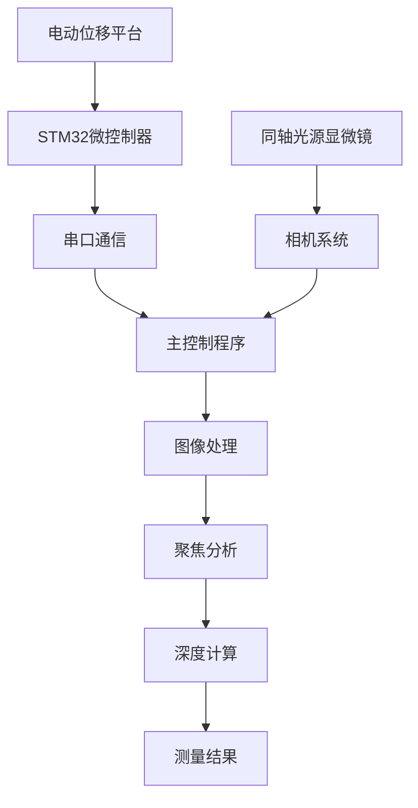
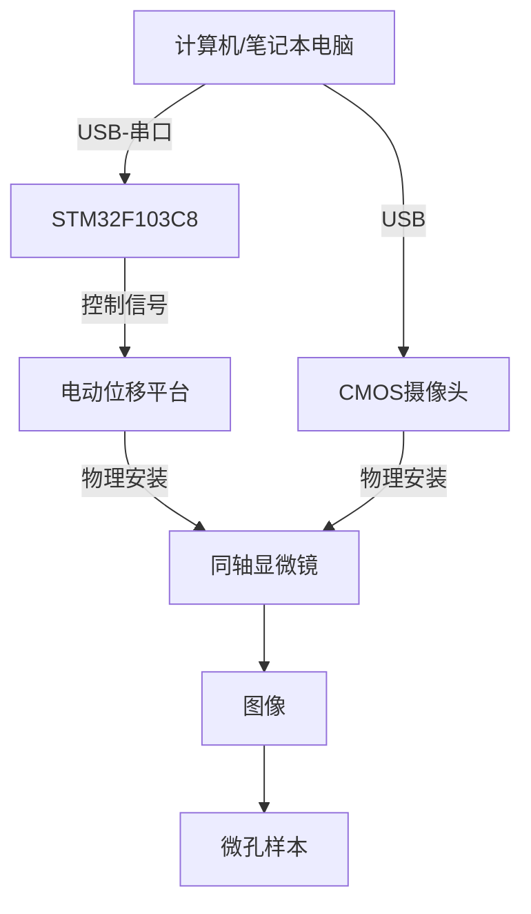
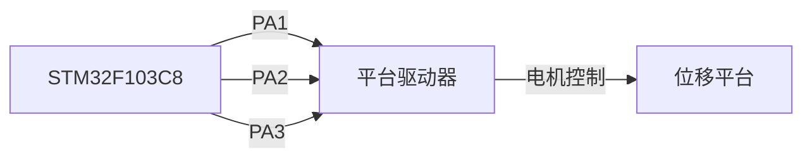

# Micro Hole Measurement
## 开始入门

### 概述

本项目基于 **SFF（Shape from Focus）方法**，用于测量大深径比微孔参数测量。实验室运行时，最小精度可稳定在小数点后三位（单位：mm），但精度受环境因素影响较大。

目前，微孔测量在工业质量控制和科学研究中面临独特挑战。传统的接触测量方法由于物理限制，无法有效测量具有大深径比的微孔。本项目通过结合硬件自动化和复杂图像处理算法的光学测量方法，旨在解决微孔测量难题。

#### 系统架构

该系统集成了硬件和软件组件，创建了一个精确的测量流程：



#### 关键组件

**硬件：**

- 配备5倍金相物镜的同轴光源显微镜
- 带控制器的电动位移平台
- STM32F103C8微控制器
- CMOS相机系统
- 笔记本电脑

**软件：**

- 主控制脚本（`main.py`）
- 图像处理库（`shot.py`）
- 聚焦分析模块（`focus_analysis.py`）

#### 工作原理

测量过程遵循以下基本步骤：

1. **图像采集**：系统自动捕捉图像，随着显微镜焦平面在不同孔深位置移动。
2. **表面检测**：通过预处理算法识别微孔上表面和下表面分别对应的像素区域
3. **聚焦分析**：使用小波变换技术测量每幅图像的聚焦质量，识别出帧序列中聚焦度最高的图像帧
4. **测量计算**：系统计算聚焦表面之间的距离，确定孔深。

整个测量过程每个样本大约需要34秒，相比传统方法显著提高了效率。

#### 技术亮点

- **基于小波变换的聚焦测量**：系统使用小波分解高精度量化图像聚焦质量，提升了识别准确度。
- **偏态高斯拟合**：应用合适的拟合曲线，准确识别最佳聚焦位置，提升系统鲁棒性。
- **半自动化操作**：系统提供直观的键盘控制，引导测量过程，同时自动化复杂计算，测量速度大幅提升。
- **边缘检测和圆拟合**：对于直径测量，系统采用Photoshop软件中基于神经网络的识别主体功能，提升了圆识别的准确率。

#### 入门指南

要开始使用这套微孔测量系统，您需要：

1. 根据规格设置硬件组件
2. 配置Python环境（推荐Python 3.8.5）
3. 将STM32微控制器连接到您的电脑
4. 运行主程序开始测量

后续文档部分将详细指导您完成这些步骤。

### 快速上手

本指南将帮助您快速设置和运行基于这套微孔测量系统。按照以下步骤操作，您只需几分钟即可完成首次测量。

在开始之前，请确保您已具备以下条件：

- 计算机上已安装Python 3.8.5
- STM32F103C8微控制器已连接并烧录程序
- 显微镜已安装5倍金相镜头并连接
- 电动位移平台已正确安装并连接
- 用于将硬件连接到计算机的USB电缆

#### 系统设置

1. **连接硬件组件**
   - 通过USB将STM32微控制器连接到计算机
   - 确保位移平台的步进电机正确连接到驱动板
   - 将相机/显微镜连接到计算机
2. **准备工作环境**
   - 创建一个干净的实验环境用于放置样本
   - 调整光路位置，使得样品表面与光轴正交
   - 确保良好的照明条件以获得最佳图像捕捉效果

#### 进行首次测量

**步骤1：启动应用程序**

1. 打开终端或命令提示符

2. 导航到micro-hole-measurement目录

3. 运行主应用程序：

   ```
   python main.py
   ```

4. 当系统提示时，输入样本ID以开始运行程序

**步骤2：相机校准和定位**

1. 程序将打开一个相机预览窗口，显示显微镜的实时视图
2. 使用以下键盘控制来定位显微镜：
   - 按`1`以小步前进
   - 按`2`以小步后退
   - 按`3`以大步前进
   - 按`4`以大步后退
3. 调整位置，直到样本的**上表面略在焦平面之后**

**步骤3：捕捉上表面图像**

1. 按`s`开始自动图像捕捉
   - 平台将开始自动向前移动
   - 每走过一个步长（5$\mu m$）都会捕捉图像
2. 继续操作，直到焦平面遍历整个上表面
3. 按`k`停止记录上表面数据

**步骤4：捕捉下表面图像**

1. 焦平面继续移动，直到样品的**下表面略在焦平面之后**
2. 再次按`k`开始记录下表面数据
3. 继续操作，直到焦点平面遍历整个下表面
4. 按`s`停止自动图像捕捉
5. 按`q`退出相机预览并开始处理

#### 处理和结果

退出相机预览后，系统将自动：

1. 处理所有捕捉的图像
2. 使用小波变换计算每幅图像的焦点质量
3. 识别顶部和底部表面的最佳聚焦图像
4. 基于位置差异计算微孔深度
5. 在终端显示结果

```
TOP最佳: 24.31
BOTTOM最佳: 57.62
孔深: 0.16655
总耗时: 34.25 秒
```

结果显示：

- 顶部表面的最佳焦点位置
- 底部表面的最佳焦点位置
- 计算出的孔深（单位：毫米）
- 总处理时间

#### 图像储存

所有捕捉的图像保存在以下目录结构中：

```
photo/YYYYMMDD_HHMMSS/
├── original/       # 原始捕捉图像
└── processed/      # 处理后的图像
    ├── top/        # 顶部表面图像
    └── bottom/     # 底部表面图像
```

文件夹名称中的时间戳对应于您开始测量过程的时间。

#### 故障排除

- **系统未检测到相机**：验证相机连接，尝试使用不同的USB端口
- **移动无响应**：检查`main.py`中配置的COM端口是否正确（默认为COM5）
- **测量结果不准确**：确保环境稳定且照明适当
- **处理时间过长**：正常处理时间应为34秒左右；如果明显更长，请检查系统资源

### 硬件设置

本指南将指导您设置微孔测量系统所需的硬件组件。该系统结合了精密光学、运动控制和数字图像处理技术，以高精度测量微孔参数。

微孔测量系统由以下主要硬件组件组成：

| 组件     | 规格                           | 用途                     |
| -------- | ------------------------------ | ------------------------ |
| 显微镜   | 带有5x金相镜头的同轴光源显微镜 | 提供微孔的高分辨率成像   |
| 位移平台 | 电动驱动，带控制器             | 使显微镜能够精确垂直移动 |
| 微控制器 | STM32F103C8                    | 控制位移平台的移动       |
| 摄像头   | USB CMOS摄像头                 | 在不同焦平面上捕捉图像   |
| 计算机   | 配有Python 3.8.5的笔记本电脑   | 处理图像并运行测量算法   |

#### 硬件连接图

硬件组件的连接方式如下所示：



#### 详细硬件设置步骤

1. **显微镜和摄像头设置**

   1. 将5x金相镜头安装在同轴光源显微镜上。
   2. 将CMOS摄像头固定在显微镜的目镜适配器上。
   3. 使用USB电缆将摄像头连接到计算机。
   4. 将微孔样本放置在显微镜前方的干板夹上。

2. **电动位移平台配置**

   1. 将显微镜牢固地安装在电动位移平台上。
   2. 将位移平台的步进电机连接到驱动板。
   3. 确保平台的移动轴垂直对齐，以便正确进行焦平面遍历。
   4. 验证平台在其整个运动范围内是否平稳移动。

3. **微控制器设置**

   1. 使用USB转串口适配器将STM32F103C8微控制器连接到计算机。

   2. 将微控制器的输出引脚连接到位移平台驱动器：

      * 使用PA1、PA2和PA3引脚向位移平台驱动器发送控制信号。

      * PC13可用于状态指示（例如，LED）。



4. **串口通信配置**

​	微控制器通过串口与计算机通信，设置如下：

| 参数   | 值                   |
| ------ | :------------------- |
| 端口   | COM5（可能有所不同） |
| 波特率 | 115200               |
| 超时   | 1秒                  |

​	如有需要，可以在`main.py`和`SingelChip.uvprojx`文件中调整这些参数。

5. **控制协议**

​	系统在计算机和微控制器之间使用简单的串口通信协议：

| 命令 | 动作     | 描述               |
| ---- | -------- | ------------------ |
| '1'  | 前进     | 将平台向前移动一步 |
| '2'  | 后退     | 将平台向后移动一步 |
| '3'  | 大步前进 | 将平台向前移动十步 |
| '4'  | 大步后退 | 将平台向后移动十步 |

#### 硬件验证

连接所有组件后，您应验证以下内容：

1. 运行程序时，摄像头预览出现
2. 位移平台响应命令
3. 十字准星叠加可见且居中
4. 系统能够在不同焦平面上捕捉图像

如果任何组件无法正常工作，请检查连接并参考故障排除部分。

#### 实验环境

测量精度受环境因素显著影响。为获得最佳结果，我向您推荐：

1. 在隔振桌或光学平台上操作系统
2. 保持一致的照明条件
3. 控制室温在20°C左右
4. 避免在更换样品的过程中引发较大的震动

#### 下一步

完成硬件设置后，请按照文档下一部分详细介绍的内容配置Python环境。

### Python环境配置

设置正确的Python环境对于运行微孔测量系统至关重要。本指南将逐步指导您完成整个过程，确保所有必要的依赖项都正确安装和配置。

微孔测量系统依赖于多个开源的Python库，用于图像处理、串口通信和数学运算。正确的环境设置确保系统能够准确处理图像、与硬件组件通信并产生可靠的测量结果。

#### Python版本要求

本项目需要**Python 3.7或更高版本**。代码使用了f-strings和类型注解等功能，这些在旧版Python中不可用。

#### 设置虚拟环境

强烈建议使用虚拟环境，以避免与其他Python项目和系统包发生冲突。这里推荐[使用anaconda创建不同python版本的虚拟环境](https://blog.csdn.net/yu20057029/article/details/144988508?fromshare=blogdetail&sharetype=blogdetail&sharerId=144988508&sharerefer=PC&sharesource=yu20057029&sharefrom=from_link)

#### 安装所需依赖项

系统依赖于多个Python库，用于图像处理、数据分析和硬件通信。以下是一个全面的依赖项列表及其用途：

| 包名              | 用途           | 使用者                 |
| ----------------- | -------------- | ---------------------- |
| OpenCV (cv2)      | 图像捕获和处理 | 图像采集、裁剪和可视化 |
| NumPy             | 数值运算       | 数组处理和数学运算     |
| SciPy             | 科学计算       | 曲线拟合和卷积运算     |
| PyWavelets (pywt) | 小波变换       | 焦点测量计算           |
| pySerial          | 串口通信       | 通过UART进行硬件控制   |
| Requests          | HTTP客户端     | 可选：微信通知功能     |

#### 安装命令

使用pip安装所有必需的包：

Copy code

```bash
# 核心依赖项
pip install numpy opencv-python scipy pywavelets pyserial 

# 可选依赖项（用于通知功能）
pip install requests
```

#### 平台特定注意事项

##### Windows用户

对于Windows用户，有一些额外的注意事项：

1. **串口配置**：系统配置为使用COM端口（例如'COM5'）。您可能需要在设备管理器中识别正确的COM端口。

   ```bash
   # 在main.py中SERIAL_PORT = 'COM5'  # 根据您的系统进行更改
   ```

2. **OpenCV摄像头访问**：系统使用默认摄像头（索引0）。如果您有多个摄像头，可能需要指定正确的索引。

   ```bash
   cap = cv2.VideoCapture(0)  # 如有需要，更改索引
   ```

##### Linux/macOS用户

在Linux和macOS上：

1. **串口**：使用适当的设备路径而不是COM端口：

   - Linux：通常是`/dev/ttyUSB0`或`/dev/ttyACM0`
   - macOS：通常是`/dev/tty.usbserial-*`或`/dev/tty.usbmodem*`

2. **摄像头权限**：在Linux上，您可能需要将用户添加到`video`组：

   ```bash
   sudo usermod -a -G video $USER
   ```

   然后注销并重新登录以使更改生效。

#### 验证您的安装

设置环境后，验证一切是否正常工作：

**检查包安装**

```bash
# 验证所有包是否已安装
pip list | grep -E 'numpy|opencv|scipy|pywt|serial|requests'
```

**运行简单测试**

创建一个名为`test_env.py`的简单测试脚本：

```python
import cv2
import numpy as np
import scipy
import pywt
import serial
import sys
 
print(f"Python版本: {sys.version}")
print(f"OpenCV版本: {cv2.__version__}")
print(f"NumPy版本: {np.__version__}")
print(f"SciPy版本: {scipy.__version__}")
print(f"PyWavelets版本: {pywt.__version__}")
print(f"pySerial版本: {serial.__version__}")
 
# 尝试访问摄像头
try:
    cap = cv2.VideoCapture(0)
    if cap.isOpened():
        ret, frame = cap.read()
        if ret:
            print("摄像头测试: 成功")
        else:
            print("摄像头测试: 失败（无法读取帧）")
        cap.release()
    else:
        print("摄像头测试: 失败（无法打开摄像头）")
except Exception as e:
    print(f"摄像头测试: 错误（{str(e)}）")
```

运行测试脚本：

```bash
python test_env.py
```

这将显示已安装包的版本并测试摄像头访问。

#### 微信通知配置（可选）

系统包括通过微信发送测量结果的功能。要使用此功能：

1. 编辑`focus_analysis.py`中的webhook URL：

```python
webhook_url_r = "在此处输入您的机器人密钥"
webhook_url_h = "在此处输入您的机器人密钥"
```

如果您不需要此功能，可以忽略这些设置。

#### 常见问题排查

**摄像头未找到**

如果系统无法访问您的摄像头：

1. 验证摄像头是否正确连接

2. 检查是否有其他应用程序正在使用摄像头

3. 尝试更改摄像头索引：

   ```python
   # 尝试不同的索引（0, 1, 2, 等）
   cap = cv2.VideoCapture(1)
   ```

**串口通信错误**

如果您遇到串口错误：

1. 检查`main.py`中是否指定了正确的端口
2. 验证微控制器是否已上电并连接
3. 确保您有访问端口的必要权限

```python
# 如有需要，更新端口和波特率
SERIAL_PORT = 'COM5'  # 更改为您的端口
BAUD_RATE = 115200    # 如果您的硬件使用不同的波特率，请更改
```

**导入错误**

如果在运行代码时看到“ModuleNotFoundError”消息：

1. 检查您的虚拟环境是否已激活

2. 验证所有必需的包是否已安装：

   ```bash
   pip install numpy opencv-python scipy pywavelets pyserial requests
   ```

3. 确保您从项目的根目录运行代码，以便Python可以找到`libs`文件夹中的本地模块。

#### 下一步

现在您的Python环境已正确配置，您现在已准备好进行微孔测量！

如果您感兴趣，可以前往[下一章节](#section-discovery)了解本项目更加详细的构成

## 深入探索 {#section-discovery}

## 主要硬件

- 同轴光显微镜 + 5 倍金相镜头
- 电动位移平台 + 驱动板
- 单片机
- 笔记本电脑

---

## 算法原理

1. **自动拍照**  
    通过电动位移平台控制显微镜移动，等间隔拍照。

2. **上位机控制**  
    - 使用 OpenCV 监视 CMOS 画面。
    - 按键操作：
      - `1`/`2`：前进/后退
      - `3`/`4`：大步长前进/后退
      - 调整焦平面至略靠前于上表面后，按 `s` 开始自动拍摄，平台自动移动。
      - 遍历上表面后，按 `k` 停止记录数据（防止数据过多拖慢计算）。
      - 焦平面移动至略靠前于底面后，再次按 `k` 开始记录。
      - 遍历底面后，按 `s` 停止记录，按 `q` 退出监视，程序开始计算孔深。

3. **数据处理**  
    - 程序通过聚焦度计算 + 偏态高斯拟合，自动选取上、下表面最佳聚焦照片。
    - 聚焦度最好的前后 2 张（共 5 张）通过企业微信机器人自动发送给负责处理孔径的同学（需配置自己的机器人 key）。
    - 捕获画面存储于 `photos/时间戳` 文件夹。

---

## 文件结构

```
micro-hole-measurement/
├── libs/                  # 算法源码（主要用 shot.py 和 focus_analysis.py）
├── photos/                # 拍摄图片存储目录
├── README.md              # 项目说明文档
└── SingleChip             # 单片机源码
```

---

## 注意事项

- 精度受环境影响较大，建议在稳定环境下测量。
- 若测量速度异常，请检查硬件连接和软件配置。
- 企业微信机器人需自行配置 key。

---

## 联系方式

如有疑问或建议，欢迎通过 Issues 或邮件联系项目维护者。

感谢大家的支持，免费分享，大家的Star就是对我最大的鼓励
