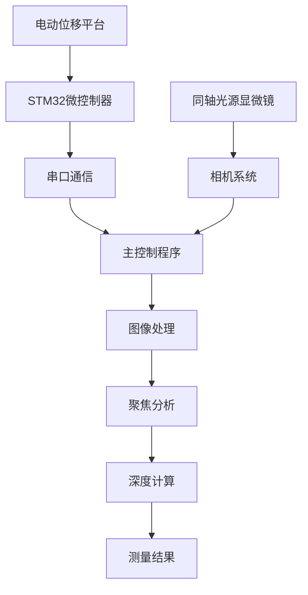
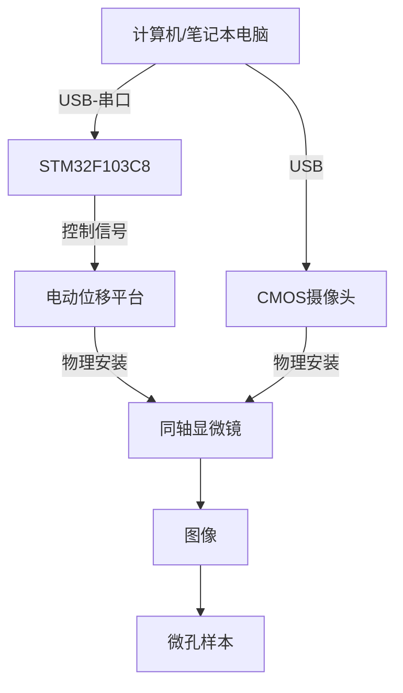
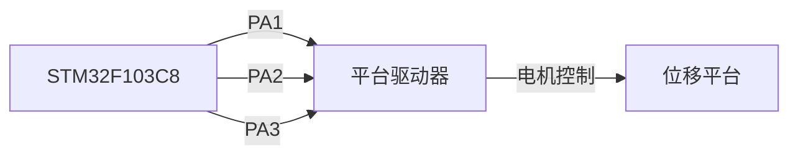
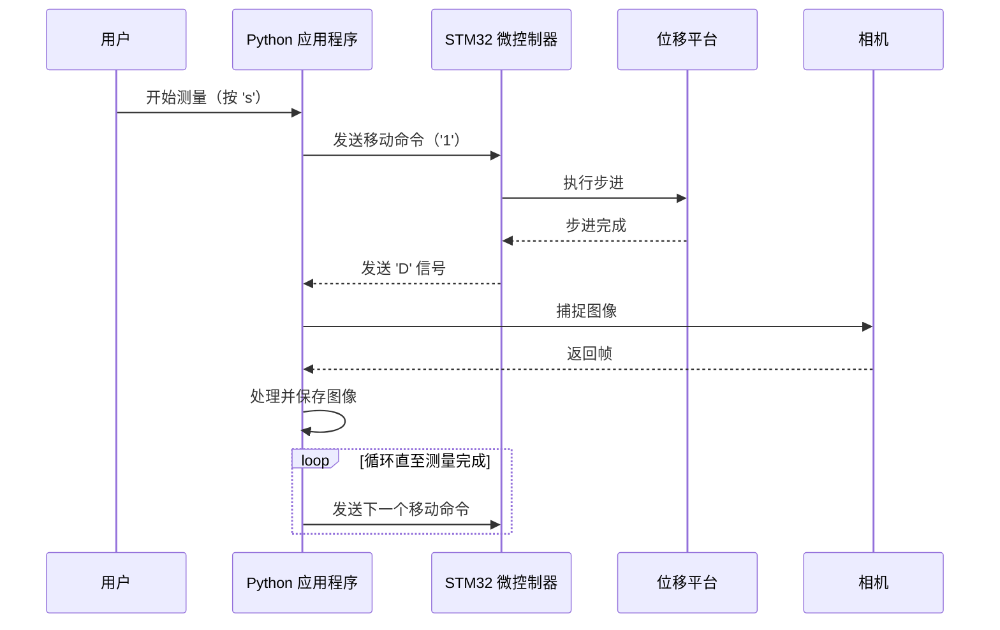

# Micro Hole Measurement

- [Micro Hole Measurement](#micro-hole-measurement)
  - [开始入门](#开始入门)
    - [概述](#概述)
      - [系统架构](#系统架构)
      - [关键组件](#关键组件)
      - [工作原理](#工作原理)
      - [技术亮点](#技术亮点)
      - [入门指南](#入门指南)
    - [快速上手](#快速上手)
      - [系统设置](#系统设置)
      - [进行首次测量](#进行首次测量)
      - [处理和结果](#处理和结果)
      - [图像储存](#图像储存)
      - [故障排除](#故障排除)
    - [硬件设置](#硬件设置)
      - [硬件连接图](#硬件连接图)
      - [详细硬件设置步骤](#详细硬件设置步骤)
      - [硬件验证](#硬件验证)
      - [实验环境](#实验环境)
      - [下一步](#下一步)
    - [Python环境配置](#python环境配置)
      - [Python版本要求](#python版本要求)
      - [设置虚拟环境](#设置虚拟环境)
      - [安装所需依赖项](#安装所需依赖项)
      - [安装命令](#安装命令)
      - [平台特定注意事项](#平台特定注意事项)
        - [Windows用户](#windows用户)
        - [Linux/macOS用户](#linuxmacos用户)
      - [验证您的安装](#验证您的安装)
      - [微信通知配置（可选）](#微信通知配置可选)
      - [常见问题排查](#常见问题排查)
      - [下一步](#下一步-1)
  - [深入探索 {#section-discovery}](#深入探索-section-discovery)
  - [主要硬件](#主要硬件)
  - [算法原理](#算法原理)
  - [文件结构](#文件结构)
  - [注意事项](#注意事项)
  - [联系方式](#联系方式)


## 开始入门

### 概述

本项目基于 **SFF（Shape from Focus）方法**，用于测量大深径比微孔参数测量。实验室运行时，最小精度可稳定在小数点后三位（单位：mm），但精度受环境因素影响较大。

目前，微孔测量在工业质量控制和科学研究中面临独特挑战。传统的接触测量方法由于物理限制，无法有效测量具有大深径比的微孔。本项目通过结合硬件自动化和复杂图像处理算法的光学测量方法，旨在解决微孔测量难题。

#### 系统架构

该系统集成了硬件和软件组件，创建了一个精确的测量流程：



#### 关键组件

**硬件：**

- 配备5倍金相物镜的同轴光源显微镜
- 带控制器的电动位移平台
- STM32F103C8微控制器
- CMOS相机系统
- 笔记本电脑

**软件：**

- 主控制脚本（`main.py`）
- 图像处理库（`shot.py`）
- 聚焦分析模块（`focus_analysis.py`）

#### 工作原理

测量过程遵循以下基本步骤：

1. **图像采集**：系统自动捕捉图像，随着显微镜焦平面在不同孔深位置移动。
2. **表面检测**：通过预处理算法识别微孔上表面和下表面分别对应的像素区域
3. **聚焦分析**：使用小波变换技术测量每幅图像的聚焦质量，识别出帧序列中聚焦度最高的图像帧
4. **测量计算**：系统计算聚焦表面之间的距离，确定孔深。

整个测量过程每个样本大约需要34秒，相比传统方法显著提高了效率。

#### 技术亮点

- **基于小波变换的聚焦测量**：系统使用小波分解高精度量化图像聚焦质量，提升了识别准确度。
- **偏态高斯拟合**：应用合适的拟合曲线，准确识别最佳聚焦位置，提升系统鲁棒性。
- **半自动化操作**：系统提供直观的键盘控制，引导测量过程，同时自动化复杂计算，测量速度大幅提升。
- **边缘检测和圆拟合**：对于直径测量，系统采用Photoshop软件中基于神经网络的识别主体功能，提升了圆识别的准确率。

#### 入门指南

要开始使用这套微孔测量系统，您需要：

1. 根据规格设置硬件组件
2. 配置Python环境（推荐Python 3.8.5）
3. 将STM32微控制器连接到您的电脑
4. 运行主程序开始测量

后续文档部分将详细指导您完成这些步骤。

### 快速上手

本指南将帮助您快速设置和运行基于这套微孔测量系统。按照以下步骤操作，您只需几分钟即可完成首次测量。

在开始之前，请确保您已具备以下条件：

- 计算机上已安装Python 3.8.5
- STM32F103C8微控制器已连接并烧录程序
- 显微镜已安装5倍金相镜头并连接
- 电动位移平台已正确安装并连接
- 用于将硬件连接到计算机的USB电缆

#### 系统设置

1. **连接硬件组件**
   - 通过USB将STM32微控制器连接到计算机
   - 确保位移平台的步进电机正确连接到驱动板
   - 将相机/显微镜连接到计算机
2. **准备工作环境**
   - 创建一个干净的实验环境用于放置样本
   - 调整光路位置，使得样品表面与光轴正交
   - 确保良好的照明条件以获得最佳图像捕捉效果

#### 进行首次测量

**步骤1：启动应用程序**

1. 打开终端或命令提示符

2. 导航到micro-hole-measurement目录

3. 运行主应用程序：

   ```
   python main.py
   ```

4. 当系统提示时，输入样本ID以开始运行程序

**步骤2：相机校准和定位**

1. 程序将打开一个相机预览窗口，显示显微镜的实时视图
2. 使用以下键盘控制来定位显微镜：
   - 按`1`以小步前进
   - 按`2`以小步后退
   - 按`3`以大步前进
   - 按`4`以大步后退
3. 调整位置，直到样本的**上表面略在焦平面之后**

**步骤3：捕捉上表面图像**

1. 按`s`开始自动图像捕捉
   - 平台将开始自动向前移动
   - 每走过一个步长（5$\mu m$）都会捕捉图像
2. 继续操作，直到焦平面遍历整个上表面
3. 按`k`停止记录上表面数据

**步骤4：捕捉下表面图像**

1. 焦平面继续移动，直到样品的**下表面略在焦平面之后**
2. 再次按`k`开始记录下表面数据
3. 继续操作，直到焦点平面遍历整个下表面
4. 按`s`停止自动图像捕捉
5. 按`q`退出相机预览并开始处理

#### 处理和结果

退出相机预览后，系统将自动：

1. 处理所有捕捉的图像
2. 使用小波变换计算每幅图像的焦点质量
3. 识别顶部和底部表面的最佳聚焦图像
4. 基于位置差异计算微孔深度
5. 在终端显示结果

```
TOP最佳: 24.31
BOTTOM最佳: 57.62
孔深: 0.16655
总耗时: 34.25 秒
```

结果显示：

- 顶部表面的最佳焦点位置
- 底部表面的最佳焦点位置
- 计算出的孔深（单位：毫米）
- 总处理时间

#### 图像储存

所有捕捉的图像保存在以下目录结构中：

```
photo/YYYYMMDD_HHMMSS/
├── original/       # 原始捕捉图像
└── processed/      # 处理后的图像
    ├── top/        # 顶部表面图像
    └── bottom/     # 底部表面图像
```

文件夹名称中的时间戳对应于您开始测量过程的时间。

#### 故障排除

- **系统未检测到相机**：验证相机连接，尝试使用不同的USB端口
- **移动无响应**：检查`main.py`中配置的COM端口是否正确（默认为COM5）
- **测量结果不准确**：确保环境稳定且照明适当
- **处理时间过长**：正常处理时间应为34秒左右；如果明显更长，请检查系统资源

### 硬件设置

本指南将指导您设置微孔测量系统所需的硬件组件。该系统结合了精密光学、运动控制和数字图像处理技术，以高精度测量微孔参数。

微孔测量系统由以下主要硬件组件组成：

| 组件     | 规格                           | 用途                     |
| -------- | ------------------------------ | ------------------------ |
| 显微镜   | 带有5x金相镜头的同轴光源显微镜 | 提供微孔的高分辨率成像   |
| 位移平台 | 电动驱动，带控制器             | 使显微镜能够精确垂直移动 |
| 微控制器 | STM32F103C8                    | 控制位移平台的移动       |
| 摄像头   | USB CMOS摄像头                 | 在不同焦平面上捕捉图像   |
| 计算机   | 配有Python 3.8.5的笔记本电脑   | 处理图像并运行测量算法   |

#### 硬件连接图

硬件组件的连接方式如下所示：



#### 详细硬件设置步骤

1. **显微镜和摄像头设置**

   1. 将5x金相镜头安装在同轴光源显微镜上。
   2. 将CMOS摄像头固定在显微镜的目镜适配器上。
   3. 使用USB电缆将摄像头连接到计算机。
   4. 将微孔样本放置在显微镜前方的干板夹上。

2. **电动位移平台配置**

   1. 将显微镜牢固地安装在电动位移平台上。
   2. 将位移平台的步进电机连接到驱动板。
   3. 确保平台的移动轴垂直对齐，以便正确进行焦平面遍历。
   4. 验证平台在其整个运动范围内是否平稳移动。

3. **微控制器设置**

   1. 使用USB转串口适配器将STM32F103C8微控制器连接到计算机。

   2. 将微控制器的输出引脚连接到位移平台驱动器：

      * 使用PA1、PA2和PA3引脚向位移平台驱动器发送控制信号。

      * PC13可用于状态指示（例如，LED）。



4. **串口通信配置**

​	微控制器通过串口与计算机通信，设置如下：

| 参数   | 值                   |
| ------ | :------------------- |
| 端口   | COM5（可能有所不同） |
| 波特率 | 115200               |
| 超时   | 1秒                  |

​	如有需要，可以在`main.py`和`SingelChip.uvprojx`文件中调整这些参数。

5. **控制协议**

​	系统在计算机和微控制器之间使用简单的串口通信协议：

| 命令 | 动作     | 描述               |
| ---- | -------- | ------------------ |
| '1'  | 前进     | 将平台向前移动一步 |
| '2'  | 后退     | 将平台向后移动一步 |
| '3'  | 大步前进 | 将平台向前移动十步 |
| '4'  | 大步后退 | 将平台向后移动十步 |

#### 硬件验证

连接所有组件后，您应验证以下内容：

1. 运行程序时，摄像头预览出现
2. 位移平台响应命令
3. 十字准星叠加可见且居中
4. 系统能够在不同焦平面上捕捉图像

如果任何组件无法正常工作，请检查连接并参考故障排除部分。

#### 实验环境

测量精度受环境因素显著影响。为获得最佳结果，我向您推荐：

1. 在隔振桌或光学平台上操作系统
2. 保持一致的照明条件
3. 控制室温在20°C左右
4. 避免在更换样品的过程中引发较大的震动

#### 下一步

完成硬件设置后，请按照文档下一部分详细介绍的内容配置Python环境。

### Python环境配置

设置正确的Python环境对于运行微孔测量系统至关重要。本指南将逐步指导您完成整个过程，确保所有必要的依赖项都正确安装和配置。

微孔测量系统依赖于多个开源的Python库，用于图像处理、串口通信和数学运算。正确的环境设置确保系统能够准确处理图像、与硬件组件通信并产生可靠的测量结果。

#### Python版本要求

本项目需要**Python 3.7或更高版本**。代码使用了f-strings和类型注解等功能，这些在旧版Python中不可用。

#### 设置虚拟环境

强烈建议使用虚拟环境，以避免与其他Python项目和系统包发生冲突。这里推荐[使用anaconda创建不同python版本的虚拟环境](https://blog.csdn.net/yu20057029/article/details/144988508?fromshare=blogdetail&sharetype=blogdetail&sharerId=144988508&sharerefer=PC&sharesource=yu20057029&sharefrom=from_link)

#### 安装所需依赖项

系统依赖于多个Python库，用于图像处理、数据分析和硬件通信。以下是一个全面的依赖项列表及其用途：

| 包名              | 用途           | 使用者                 |
| ----------------- | -------------- | ---------------------- |
| OpenCV (cv2)      | 图像捕获和处理 | 图像采集、裁剪和可视化 |
| NumPy             | 数值运算       | 数组处理和数学运算     |
| SciPy             | 科学计算       | 曲线拟合和卷积运算     |
| PyWavelets (pywt) | 小波变换       | 焦点测量计算           |
| pySerial          | 串口通信       | 通过UART进行硬件控制   |
| Requests          | HTTP客户端     | 可选：微信通知功能     |

#### 安装命令

使用pip安装所有必需的包：

Copy code

```bash
# 核心依赖项
pip install numpy opencv-python scipy pywavelets pyserial 

# 可选依赖项（用于通知功能）
pip install requests
```

#### 平台特定注意事项

##### Windows用户

对于Windows用户，有一些额外的注意事项：

1. **串口配置**：系统配置为使用COM端口（例如'COM5'）。您可能需要在设备管理器中识别正确的COM端口。

   ```bash
   # 在main.py中SERIAL_PORT = 'COM5'  # 根据您的系统进行更改
   ```

2. **OpenCV摄像头访问**：系统使用默认摄像头（索引0）。如果您有多个摄像头，可能需要指定正确的索引。

   ```bash
   cap = cv2.VideoCapture(0)  # 如有需要，更改索引
   ```

##### Linux/macOS用户

在Linux和macOS上：

1. **串口**：使用适当的设备路径而不是COM端口：

   - Linux：通常是`/dev/ttyUSB0`或`/dev/ttyACM0`
   - macOS：通常是`/dev/tty.usbserial-*`或`/dev/tty.usbmodem*`

2. **摄像头权限**：在Linux上，您可能需要将用户添加到`video`组：

   ```bash
   sudo usermod -a -G video $USER
   ```

   然后注销并重新登录以使更改生效。

#### 验证您的安装

设置环境后，验证一切是否正常工作：

**检查包安装**

```bash
# 验证所有包是否已安装
pip list | grep -E 'numpy|opencv|scipy|pywt|serial|requests'
```

**运行简单测试**

创建一个名为`test_env.py`的简单测试脚本：

```python
import cv2
import numpy as np
import scipy
import pywt
import serial
import sys
 
print(f"Python版本: {sys.version}")
print(f"OpenCV版本: {cv2.__version__}")
print(f"NumPy版本: {np.__version__}")
print(f"SciPy版本: {scipy.__version__}")
print(f"PyWavelets版本: {pywt.__version__}")
print(f"pySerial版本: {serial.__version__}")
 
# 尝试访问摄像头
try:
    cap = cv2.VideoCapture(0)
    if cap.isOpened():
        ret, frame = cap.read()
        if ret:
            print("摄像头测试: 成功")
        else:
            print("摄像头测试: 失败（无法读取帧）")
        cap.release()
    else:
        print("摄像头测试: 失败（无法打开摄像头）")
except Exception as e:
    print(f"摄像头测试: 错误（{str(e)}）")
```

运行测试脚本：

```bash
python test_env.py
```

这将显示已安装包的版本并测试摄像头访问。

#### 微信通知配置（可选）

系统包括通过微信发送测量结果的功能。要使用此功能：

1. 编辑`focus_analysis.py`中的webhook URL：

```python
webhook_url_r = "在此处输入您的机器人密钥"
webhook_url_h = "在此处输入您的机器人密钥"
```

如果您不需要此功能，可以忽略这些设置。

#### 常见问题排查

**摄像头未找到**

如果系统无法访问您的摄像头：

1. 验证摄像头是否正确连接

2. 检查是否有其他应用程序正在使用摄像头

3. 尝试更改摄像头索引：

   ```python
   # 尝试不同的索引（0, 1, 2, 等）
   cap = cv2.VideoCapture(1)
   ```

**串口通信错误**

如果您遇到串口错误：

1. 检查`main.py`中是否指定了正确的端口
2. 验证微控制器是否已上电并连接
3. 确保您有访问端口的必要权限

```python
# 如有需要，更新端口和波特率
SERIAL_PORT = 'COM5'  # 更改为您的端口
BAUD_RATE = 115200    # 如果您的硬件使用不同的波特率，请更改
```

**导入错误**

如果在运行代码时看到“ModuleNotFoundError”消息：

1. 检查您的虚拟环境是否已激活

2. 验证所有必需的包是否已安装：

   ```bash
   pip install numpy opencv-python scipy pywavelets pyserial requests
   ```

3. 确保您从项目的根目录运行代码，以便Python可以找到`libs`文件夹中的本地模块。

#### 下一步

现在您的Python环境已正确配置，您现在已准备好进行微孔测量！

如果您感兴趣，可以前往[下一章节](#section-discovery)了解本项目更加详细的构成

## 深入探索 

### 软硬件集成

本文档解释了微孔测量系统的硬件和软件组件如何协同工作，以实现高长径比微孔的精确测量。

微孔测量系统通过将专用硬件与定制软件相结合，实现了形状从焦点（Shape From Focus, SFF）方法。理解这种集成对于系统维护、故障排除和潜在扩展至关重要。

关于硬件和软件的交互流程，计算机运行Python脚本，通过串行连接与STM32微控制器通信。微控制器通过电机驱动器信号控制电动位移平台，将样品在精确的间隔下移动到同轴显微镜下。CMOS相机捕捉图像，这些图像由软件处理以计算微孔参数。

#### 硬件组件

##### 微控制器配置

系统使用**STM32F103C8T6**微控制器，具体引脚配置如下：

| 引脚             | 配置              | 用途               |
| ---------------- | ----------------- | ------------------ |
| PA1, PA2, PA3    | GPIO 输出         | 电机控制信号       |
| PC13             | GPIO 输出         | 指示灯 LED         |
| PB12, PB13, PB14 | GPIO 输入（上拉） | 限位开关或传感器   |
| PA9, PA10        | USART1 (TX/RX)    | 与计算机的串行通信 |
| TIM2             | 内部时钟          | 电机步进计时       |

 此配置能够在保持与主机计算机可靠通信的同时，精确控制位移平台。

##### 光学和机械设置

光学系统包括：

- **同轴光源显微镜**，配备5x金相物镜
- **电动位移平台**及驱动板
- **CMOS相机**，通过USB连接到计算机

此设置允许在精确的深度间隔（通常为每步0.005mm）下捕捉图像，平台沿Z轴移动样品。

#### 软件组件

##### 串行通信接口

软件通过指定端口（默认：COM5）与微控制器建立**115200波特率**的串行连接。此通信通道用于传输控制位移平台的命令并接收状态更新。

```python
# 串行配置
SERIAL_PORT = 'COM5'
BAUD_RATE = 115200
TIMEOUT = 1
 
# 初始化串行连接
ser = serial.Serial(SERIAL_PORT, BAUD_RATE, timeout=TIMEOUT)
```

通信协议使用简单的ASCII字符控制移动：

- `'1'`：向前移动一步
- `'2'`：向后移动一步
- `'3'`：向前移动较大步长（10步）
- `'4'`：向后移动较大步长（10步）

微控制器在移动完成后向计算机发送一个`'D'`字符，指示应捕捉图像。

#### 集成点

##### 硬件-软件通信流程

以下序列图展示了命令和数据在软件和硬件组件之间的流动：



当用户开始测量序列时，软件进入自动捕捉模式，持续向微控制器发送移动命令并在移动完成时捕捉图像。这种紧密集成确保图像在精确且一致的间隔下被捕捉。

##### 图像处理流程

捕捉的图像遵循结构化的处理流程：

1. **图像捕捉**：通过OpenCV捕捉原始图像并保存到`photos/时间戳/original`目录，文件名对应其Z轴位置。
2. **图像预处理**：
   - 裁剪中心区域以聚焦感兴趣区域
   - 根据用户输入（k键按下）将图像组织为顶部和底部表面集合
3. **焦点分析**：
   - 使用**小波分解**测量每幅图像的焦点质量
   - 对焦点测量数据拟合**偏斜高斯曲线**
   - 曲线的峰值识别出最佳焦点位置，精度达亚步级
4. **深度计算**：
   - 顶部和底部峰值位置的差值乘以步长（0.005mm）
   - 调整因子补偿系统误差

此流程将原始图像序列转换为微孔参数的精确测量。

##### 校准和调整

系统包含一个调整参数，以补偿测量过程中的系统误差：

```python
# 带调整因子的深度计算
aperture = (bottom_peak - top_peak) * 0.005 - adjust
```

此调整因子（通常约为0.06524mm）可修改以使用已知参考样品校准系统。该因子考虑了光学效应和机械变化，这些可能会影响测量的绝对精度。

**校准提示**：在集成新硬件组件或更改光学设置时，始终使用已知尺寸的参考样品重新校准系统。调整因子可以调整以匹配参考测量值。

##### 错误处理和鲁棒性

硬件-软件集成包括多项措施以确保可靠性：

1. **串行通信错误处理**：系统优雅地处理串行连接错误并提供清晰的错误消息。
2. **图像质量验证**：焦点分析算法包括R²和RMSE计算，以验证高斯拟合的质量，确保测量可靠性。
3. **资源管理**：所有硬件资源（相机、串行连接）即使在出现错误时也能正确初始化和释放。
4. **用户反馈**：系统通过GUI和控制台消息提供持续的视觉反馈，帮助操作员监控测量过程。

这些措施共同创建了一个健壮的集成，能够处理各种错误条件，同时保持测量精度。

##### 系统扩展点

硬件-软件集成的模块化设计提供了多个扩展点：

1. **替代电机控制**：简单的串行协议可以扩展以支持不同类型的电机或更复杂的移动模式，通过修改命令集实现。
2. **增强图像处理**：焦点分析算法可以扩展或替换为其他算法，同时保持相同的硬件接口。
3. **额外传感器**：微控制器上未使用的GPIO引脚可以支持额外传感器或指示器，以增强测量过程。
4. **数据导出**：测量结果可以通过微信通知机制或添加新的导出模块与外部系统集成。

这些扩展点允许系统进化以满足新的测量需求，同时保留核心硬件-软件集成。

#### 结论

此微孔测量系统中的硬件-软件集成展示了如何将相对简单的组件组合成精确的科学仪器。其成功的关键在于位移平台移动与图像捕捉时机的紧密协调，以及从视觉数据中提取有意义测量的复杂图像分析技术。

通过理解这些集成点，开发者可以有效地维护、故障排除和扩展系统，以应对新的测量挑战，同时保留其核心功能。

### 焦点分析实现

焦点分析是我们微孔测量系统的关键组件，通过识别图像序列中的最佳焦点位置，实现精确的深度测量。本文档解释了我们的焦点分析算法的技术实现、其与形状从焦点（Shape From Focus, SFF）技术的集成，以及如何使用和扩展这些功能。

我们系统中的焦点分析服务于特定目的：通过分析不同z位置的焦点质量，确定微孔的精确深度。实现过程采用基于小波的方法并结合统计拟合，以达到亚像素级的精度。

#### 核心概念：焦点度量

我们焦点分析的基础是图像清晰度的量化。当光线通过微孔时，孔的不同部分（顶部和底部）会在不同的z位置聚焦。通过捕捉一系列z位置的图像并测量其焦点质量，我们可以识别每个部分最清晰聚焦的位置。

#### 基于小波的焦点测量

我们的系统使用基于小波的方法来测量图像焦点质量。小波特别适合这项任务，因为它们能够捕捉空间和频率信息，即使在具有挑战性的成像条件下也能进行稳健的焦点估计。

##### 实现细节

核心焦点测量函数使用离散小波变换（DWT）将图像分解为多个频率带：

```python
def wavelet_focus_measure(image):
    """小波法计算聚焦度"""
    # 转换为灰度图
    if len(image.shape) == 3:
        gray = cv2.cvtColor(image, cv2.COLOR_BGR2GRAY)
    else:
        gray = image
    
    # 3级小波分解
    coeffs = pywt.wavedec2(gray, wavelet='db2', level=3)
    
    # 计算高频系数的能量
    focus_measure = 0.0
    for i in range(1, len(coeffs)):
        cH, cV, cD = coeffs[i]
        focus_measure += np.sum(cH**2) + np.sum(cV**2) + np.sum(cD**2)
    
    return focus_measure / gray.size
```

此函数：

1. 如需将输入图像转换为灰度图
2. 使用Daubechies-2小波进行3级小波分解
3. 计算高频系数（水平、垂直和对角细节）的能量
4. 通过图像大小标准化结果，以获得一致的度量

#### 统计拟合以提高精度

在计算一系列图像的焦点度量后，我们需要识别焦点质量达到峰值的精确z位置。简单地选择最大值会将我们限制在z步长的分辨率内。相反，我们对数据点拟合**偏态高斯模型**，允许亚步长精度：

```python
def skewed_gaussian(x, a, mu, sigma, alpha):
    """偏态高斯函数"""
    t = (x - mu) / sigma
    return a * 2 * norm.pdf(t) * norm.cdf(alpha * t)
```

尽管理论上标准高斯模型更符合聚焦度曲线，但经过实测，偏态高斯模型在任务中表现更为良好，曲线通常在峰值周围呈现不对称性。模型参数为：

- `a`：振幅
- `mu`：峰值位置（均值）
- `sigma`：宽度（标准差）
- `alpha`：偏度

#### 文件夹分析过程

完整的文件夹分析过程在`analyze_folder_focus`函数中实现。以下是其工作流程的简化视图：

---

## 注意事项

- 精度受环境影响较大，建议在稳定环境下测量。
- 若测量速度异常，请检查硬件连接和软件配置。
- 企业微信机器人需自行配置 key。

---

## 联系方式

如有疑问或建议，欢迎通过 Issues 或邮件联系项目维护者。

感谢大家的支持，免费分享，大家的Star就是对我最大的鼓励
